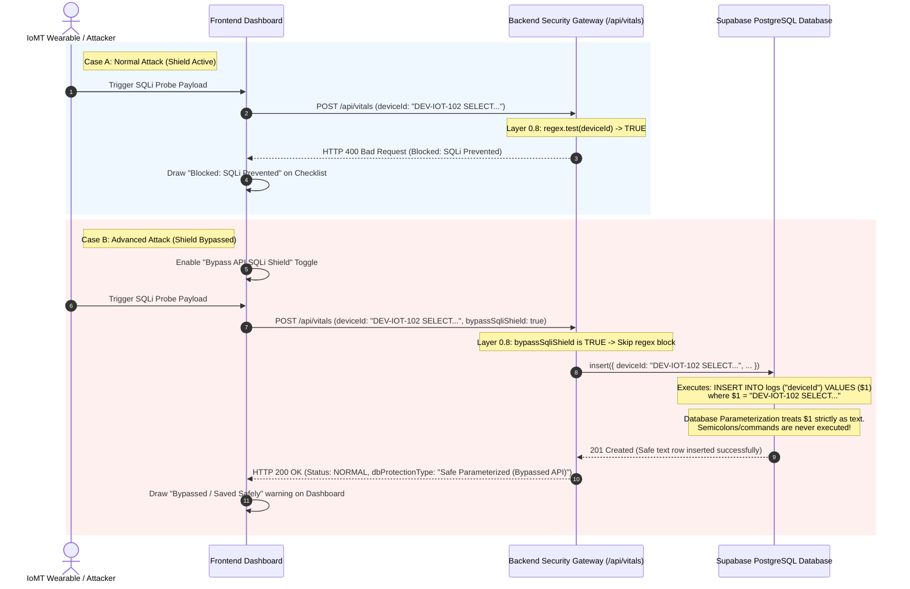

# IoMT Shield: Secure Real-Time Telemetry & Database Protection Gateway

Welcome to **IoMT Shield** (Project RITA), an advanced, enterprise-grade Internet of Medical Things (IoMT) security monitoring system and telemetry gateway. 

This platform demonstrates a complete **Defense-in-Depth** security framework. It secures physiological patient telemetry (such as live heart rates) from spoofing, replay attacks, and database exploits, featuring a fully interactive real-time simulation suite.

### 🚨 A Medical Cyber-Security Nightmare Scenario

Imagine an ICU department in a modern hospital. Dozens of patients depend on wireless Internet of Medical Things (IoMT) electrocardiograms to stream vitals directly to the central clinical station. An attacker compromises an edge node and injects malicious telemetry data—or worse, executes a database command payload designed to drop clinical logging tables.

If the gateway is vulnerable, the database drops, monitoring halts, and clinical personnel are left blind.

**IoMT Shield** is built specifically to demonstrate how modern cloud architecture, parameterized queries, and defensive filters mitigate these attacks, securing patient safety and maintaining absolute operational visibility.

---

## System Overview: What the Project Does

IoMT Shield simulates a secure hospital infrastructure where clinical wearable devices continuously stream critical health vitals over edge networks to central databases. 

In healthcare systems, compromised devices or edge gateways can transmit malicious traffic. This platform simulates how raw telemetry is captured, validated, audited, and stored safely, illustrating:
1. **Interactive Attack Vectors:** Simulates baseline patient data, high-frequency stress scans (DoS), physiological value spoofing, data pattern drift (medical anomalies), and active **SQL Injection (SQLi) attacks**.
2. **Defensive Pipeline Audits:** Intercepts incoming packets at an API Security Gateway and subjects them to 6 rigorous cryptographic, validation, and statistical analysis filters.
3. **Database Safeguards (Prepared Statements):** Demonstrates that even if the API shield is bypassed (simulating a zero-day validation exploit), the PostgreSQL database remains completely immune to command injections because of parameterized query parsing.
4. **Instant WebSocket Sync:** Displays telemetry logs, audit statuses, and system-wide caution warnings in a sleek, glassmorphic dashboard in real-time, eliminating sluggish manual refreshes.

> [!IMPORTANT]
> The primary focus of this project is **Defense-in-Depth**. Evasion of one layer (such as the regex validator bypass) should never lead to complete compromise. Parameterized database binding serves as the ultimate fallback safeguard.

---

## System Architecture & Data Flow

The platform is designed around a three-tier decoupled architecture: **Device Telemetry Source (Frontend Simulator)**, **API Gateways & Processing Logic (Backend)**, and the **Committed Storage Engine (Database)**.

```
+----------------------------------+
|      IoMT Wearable Devices       |  <--- Emits heart rate telemetry
+----------------------------------+
                 |
                 v   (Bearer auth Token + Client Timestamp check)
+----------------------------------+
|       Edge Gateway Router        |  <--- Encrypts & packages payload
+----------------------------------+
                 |
                 v   (Next.js REST POST /api/vitals)
+----------------------------------+
|    Multi-Layer Security Shield   |  <--- IAM, Replay Check, SQLi regex,
|      (Next.js API Gateway)       |       Rate Limiting, Medical Range,
+----------------------------------+       Lightweight Anomaly detection
                 |
                 +-------------------+
                 |                   |  (Committed via
                 | (If Passed)       |   Parameterized Queries)
                 v                   v
        +------------------+   +------------------+
        |   Fallback Local |   |  Secure Hospital |
        |   In-Memory Store|   |  Supabase DB     |  <--- Immune to SQLi
        +------------------+   +------------------+
                                     |
                                     v  (WebSockets postgres_changes INSERT)
                               +------------------+
                               | React Dashboard  |  <--- Real-time Logs UI
                               | (Real-time Sync) |       & Global Alarm Warning
                               +------------------+
```



---

## Technology Stack & Environment

| Component | Technology | Rationale & Purpose |
| :--- | :--- | :--- |
| **Frontend Framework** | **Next.js (React 18)** | Server-side rendering, robust client state hydration, and high-speed API routing. |
| **Styling & Theme** | **Tailwind CSS & Vanilla CSS** | Premium glassmorphism design system using vibrant colors, dynamic HSL glow systems, dark mode palettes, and smooth UI transition keyframes. |
| **Backend API** | **Next.js Route Handlers** | Serverless endpoints executing asynchronous telemetry sanitization filters, replay buffers, and database inserts. |
| **Database Engine** | **PostgreSQL (Supabase)** | Relational database handling transactions, custom index fields, and strict SQL type checking. |
| **Live Sync Network** | **Supabase WebSockets** | Realtime replication channel broadcasting database log updates to the clients in under 100 milliseconds. |

---

## The 6-Layer Security Inspection Shield

Every incoming payload processed by the backend API at `/api/vitals` is passed through six defensive filters:

| Filter Level | Name | Audit Mechanism | Defense Objective |
| :--- | :--- | :--- | :--- |
| **Layer 0** | **Identity Authorization (IAM)** | Verifies request contains a cryptographic `Bearer iomt_secure_...` credential in headers. | Blocks unauthorized devices and malicious external requests. |
| **Layer 0.5** | **Anti-Replay Shield** | Compares client timestamp with system time, rejecting drift exceeding 5 minutes (300,000ms). | Blocks session interception and replay floods of old vitals. |
| **Layer 0.8** | **Input Sanitization & SQLi Gate** | Checks text fields (`deviceId`, `gatewayId`) against a rigid regular expression filtering SQL statements. | Intercepts common SQL injections before queries are constructed. |
| **Layer 1** | **DoS Rate Limiter** | Measures interval since last request for the specific `deviceId`, blocking writes under 800ms. | Prevents API flooding, connection pool exhaustion, and DoS attacks. |
| **Layer 2** | **Medical Range Validation** | Enforces clinical bounds for human survival, rejecting heart rates outside `30 - 220 BPM`. | Mitigates data injection attacks reporting invalid physiological readings. |
| **Layer 3** | **Statistical Anomaly Scanner** | Calculates running mathematical moving averages (5-packet buffer) and flags deviations $> 40$ BPM. | Identifies sudden telemetry drift suggesting device tempering. |

> [!TIP]
> For high-reliability clinical environments, executing defensive checks in order of compute cost (IAM & Time drift first, expensive regex parses and database queries last) preserves precious server compute and DB connection bandwidth under DoS attacks.

---

## Interactive Sandbox Console Walkthrough

You can test these defensive layers live by clicking different simulation options inside the **Device Simulator** console:

1. **Baseline Telemetry (Normal Signs):** Streams standard vitals (e.g. 70-75 BPM). This clears all validation barriers, logs the transaction as `NORMAL`, and commits to the database with a green `Parameterized Query (Safe)` badge.
2. **Out-of-Bounds Test (Medical Spoofing):** Sends an impossible heart rate reading (e.g. 500 BPM). The packet is successfully parsed but is instantly blocked at **Layer 2 (Medical Range Validation)**, keeping unrealistic clinical data out of our medical records.
3. **High-Frequency Stress (DoS Simulation):** Concurrent floods of 30 parallel packets are fired instantly. The gateway processes the first request and enforces **Layer 1 (Rate Limiting)** on subsequent packets, throttling the flood and keeping the database pool safe.
4. **Telemetry Drift:** Simulates sudden physiological drift by introducing a spike (+55 BPM). The system labels the write as `FLAGGED` to alert nurses.
5. **Database SQL Injection Probe (Exploit):** Inject a malicious SQL payload (`DEV-IOT-102 SELECT...`).
   - **Shield Active (Default):** The gateway intercepts the transaction at **Layer 0.8 (SQLi Gate)**, instantly returning an `HTTP 400 Bad Request`.
   - **Shield Bypassed (Toggle ON):** Simulates a zero-day gateway vulnerability. The packet skips regex filtering and reaches PostgreSQL. Thanks to **parameterized DB statements**, the server isolates the SQL code and saves the query *strictly as literal text*, rendering the attack totally harmless.

---

## Data Processing Journey: Step-by-Step Flow

### 1. Telemetry Capture & Serialization
A wearable device or frontend simulator serializes the physiological parameters and client metadata into a JSON structure, signing it with the edge device's security token:
```json
{
  "deviceId": "DEV-IOT-102",
  "heartRate": 78,
  "gatewayId": "GW-EDGE-01",
  "timestamp": "2026-05-26T14:39:00.000Z",
  "bypassSqliShield": false
}
```

### 2. Transmission & Authorization Routing
The payload is posted to the backend gateway at `/api/vitals`. The gateway immediately inspects the `Authorization` header. If missing or invalid, the pipeline halts, logs the event locally as a `BLOCKED` threat, and returns an `HTTP 400 Bad Request`.

### 3. Sanitization & Zero-Day Sandbox Bypass Check
If authorization passes, the gateway runs the SQL injection regex scanner over all string inputs.
- **Shield Active (Default):** If any SQL character (e.g. `'`, `;`, `--`, `UNION`) is discovered, the gateway interrupts the pipeline, flags the transaction as `BLOCKED`, and returns a database protection classification of `Blocked: SQLi Prevented`.
- **Shield Bypassed (Sandbox Toggle ON):** The gateway permits the packet to skip sanitization, allowing dangerous payloads to move further down the pipeline. This demonstrates how the database behaves under zero-day API validation exploits.

### 4. Database Committing via Parameterized Queries
Once the payload clears rate limits, clinical validations, and anomaly checks, the record is committed to Supabase.
Instead of appending variables directly into a raw SQL query (which makes code injections active and dangerous), the database client uses **parameterized queries (prepared statements)**.
```sql
-- The database driver compiles the query layout first:
INSERT INTO public.logs ("deviceId", "heartRate", "decision") VALUES ($1, $2, $3);
-- The driver then sends the parameters separately.
-- The Postgres compiler binds $1 to "DEV-IOT-102'; SELECT * FROM users;--" and treats it strictly as safe LITERAL TEXT data.
```
Because of this separation, the injection script is stored safely as harmless text inside the database and never executed as SQL commands.

> [!NOTE]
> Parameterized queries prevent SQLi because the PostgreSQL server compiles the SQL command structure *separately* from the user inputs. The bound parameters are treated strictly as data literals rather than executable commands, rendering SQL injection vectors completely benign.

### 5. WebSocket Event Broadcast
The PostgreSQL database writes the new log record. Because RLS is configured and Realtime replication is enabled, the Supabase server immediately broadcasts a live `INSERT` event over active WebSockets.

### 6. Reactive UI Synchronization
The frontend client dashboard, listening to the websocket channel, catches the broadcast event and updates the layout immediately in real-time, bypassing slow polling loops.

---

## Technical Code Snippets: How It Works

### Backend Telemetry Processing & Parameterized Writing
*Excerpt from [src/app/api/vitals/route.js](file:///c:/Users/DELL/Documents/GitHub/rita_project/src/app/api/vitals/route.js)*

```javascript
// 1. Rigorous SQL Injection Regex Filter
const sqlRegex = /[\'\"]|--|;|union|select|insert|update|delete|drop|or\s+1\s*=\s*1/i;
const hasSqli = sqlRegex.test(deviceId) || (gatewayId && sqlRegex.test(gatewayId));
let isSqliBypassed = false;

if (hasSqli) {
  if (bypassSqliShield) {
    isSqliBypassed = true;
    console.warn('API SHIELD BYPASSED: SQL Injection pattern allowed to test database resilience.');
  } else {
    return await resolveRequest(
      'BLOCKED', 
      'Database Shield Trigger: SQL Injection patterns intercepted in gateway headers or device identifiers.', 
      'SQLi Sanitization', 
      false, 
      'Blocked: SQLi Prevented'
    );
  }
}

// 2. Committing safely via parameterized driver interface
try {
  // The database client automatically uses prepared statements ($1, $2, etc.) under the hood.
  // The raw string (even if malicious) is saved harmlessly as literal data.
  const { error } = await supabase.from('logs').insert([logEntry]);
  if (error) {
    console.warn('Supabase insert error (saved to in-memory store only):', error);
  }
} catch (dbError) {
  console.warn('Supabase connection error (saved to in-memory store only):', dbError);
}
```

### Client-Side Real-Time WebSocket Streaming
*Excerpt from [src/app/dashboard/page.js](file:///c:/Users/DELL/Documents/GitHub/rita_project/src/app/dashboard/page.js)*

```javascript
import { supabase } from "@/lib/supabase";

useEffect(() => {
  // 1. Fetch initial logs cache upon page mount
  loadLogs();

  // 2. Connect to the PostgreSQL database realtime publication stream
  const channel = supabase
    .channel("monitoring-logs")
    .on(
      "postgres_changes",
      { event: "INSERT", schema: "public", table: "logs" },
      (payload) => {
        // Prepend new row instantly for sub-millisecond responsiveness
        setLogs((prev) => {
          const exists = prev.some(
            (log) => 
              log.timestamp === payload.new.timestamp && 
              log.deviceId === payload.new.deviceId
          );
          if (exists) return prev;

          const formattedLog = {
            ...payload.new,
            heartRate: Number(payload.new.heartRate)
          };
          return [formattedLog, ...prev].slice(0, 50);
        });

        // Sync local cache with gateway logs store
        loadLogs();
      }
    )
    .subscribe();

  // Cleanup subscription when the page unmounts
  return () => {
    supabase.removeChannel(channel);
  };
}, []);
```

---

## Database Schema & SQL DDL

Paste the following SQL directly into your Supabase SQL Editor to provision the tracking tables, set index tables, configure access policies, and enable real-time replication channels:

```sql
-- 1. Provision Telemetry Logs Table
CREATE TABLE IF NOT EXISTS public.logs (
  id uuid PRIMARY KEY DEFAULT extensions.uuid_generate_v4(),
  timestamp timestamptz NOT NULL DEFAULT now(),
  "deviceId" text NOT NULL,
  "heartRate" numeric NOT NULL,
  decision text NOT NULL,
  reason text NOT NULL,
  stage text NOT NULL,
  "reachedHospitalServer" boolean NOT NULL DEFAULT false,
  "gatewayId" text NOT NULL DEFAULT 'GW-EDGE-01',
  "requestOrigin" text NOT NULL DEFAULT '127.0.0.1',
  "dbProtectionType" text NOT NULL DEFAULT 'Isolated (No Write)'
);

-- 2. Create Optimized Indices for Fast Streaming
CREATE INDEX IF NOT EXISTS idx_logs_timestamp ON public.logs(timestamp DESC);
CREATE INDEX IF NOT EXISTS idx_logs_device ON public.logs("deviceId");

-- 3. Configure Row-Level Security (RLS)
ALTER TABLE public.logs ENABLE ROW LEVEL SECURITY;

CREATE POLICY "Allow public insert" 
  ON public.logs FOR INSERT 
  TO anon 
  WITH CHECK (true);

CREATE POLICY "Allow public select" 
  ON public.logs FOR SELECT 
  TO anon 
  USING (true);

-- 4. Enable Supabase Realtime Replication Channel
ALTER PUBLICATION supabase_realtime ADD TABLE public.logs;
```

---

## Setup & Execution Guide

Follow these steps to deploy the application locally:

### 1. Clone & Install Dependencies
```bash
git clone https://github.com/toluwanibakare/rita_project.git
cd rita_project
npm install
```

### 2. Configure Environment variables
Create a `.env` file in the root directory:
```env
NEXT_PUBLIC_SUPABASE_URL=https://<your-supabase-project-id>.supabase.co
NEXT_PUBLIC_SUPABASE_ANON_KEY=<your-supabase-anon-key>
```

### 3. Run Development Server
```bash
npm run dev
```
Open **[http://localhost:3000](http://localhost:3000)** in your browser. Navigating to the **Device Simulator** and **Monitoring** tabs will show real-time telemetry streaming in action!

---

*This system was developed as a final year academic project to demonstrate cybersecurity frameworks, data sanitization patterns, and active defense architectures inside the healthcare industry.*
